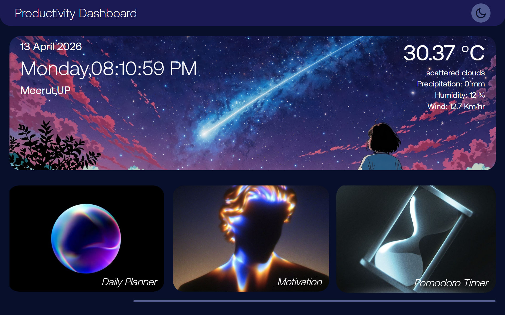
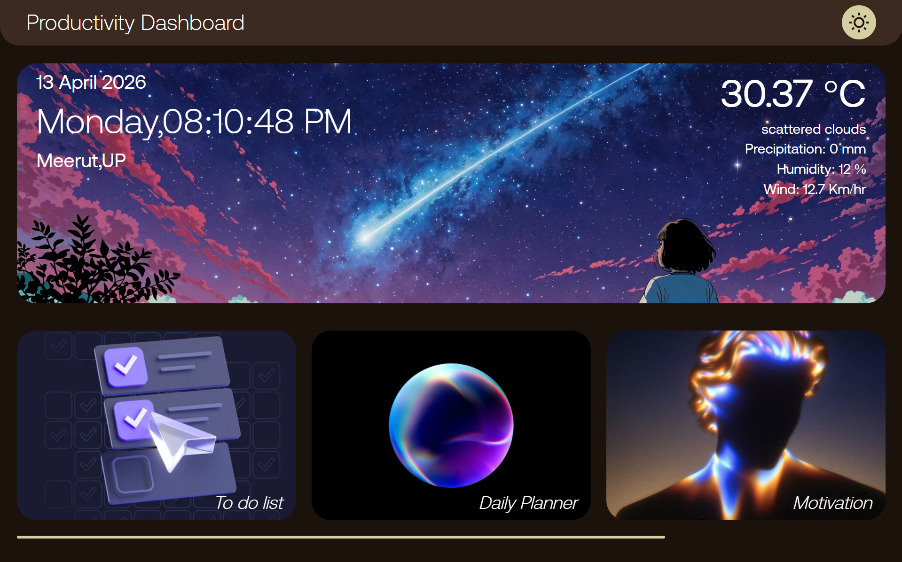

# 📊 Productivity Dashboard

> A modern, responsive web-based productivity dashboard built with vanilla HTML, CSS, and JavaScript.

A unified platform for managing your daily workflow, tasks, goals, and focus sessions—all in one beautiful, theme-able interface.



---

## ✨ Features

### 📝 Task Management
- Create, view, and delete tasks with optional importance flags
- Real-time task rendering with persistent storage
- Mark tasks as completed with one click
- Task details saved in browser localStorage

### 📅 Daily Planner
- Hour-by-hour planning from 6 AM to midnight
- Auto-save to localStorage as you type
- Responsive layout for all screen sizes
- Quickly reschedule and reorganize your day

### ⏲️ Pomodoro Timer
- 25-minute focused work sessions (configurable)
- 5-minute break intervals (configurable)
- Visual work/break session indicators
- Automatic transitions between work and break states

### 💬 Motivational Quotes
- Random inspirational quotes fetched live from Quotable API
- Display author attribution for each quote
- Beautifully styled quote card with blur effect background
- Fresh quote on every feature load

### 🌤️ Live Weather Widget
- Real-time weather data for your city (default: Meerut)
- Display temperature, conditions, humidity, precipitation, and wind speed
- Updates automatically on page load
- Easy configuration for different locations

### 🌅 Time & Context Awareness
- Live clock with real-time updates (every second)
- Full date display with day of week
- Dynamic header background images based on time of day
  - 5 AM – 12 PM: Morning (sunrise)
  - 12 PM – 6 PM: Afternoon
  - 6 PM – 5 AM: Evening/Night

### 🎨 Theme System
- Light and dark theme Toggle
- Semantic color tokens for easy customization
- Theme preference persists across browser sessions
- Smooth transitions between themes
- Responsive icon changes (sun/moon)

### 📱 Responsive Design
- Fully responsive for mobile, tablet, desktop, and 4K screens
- Custom breakpoints for 1600px+ (4K optimization)
- Fluid typography using CSS clamp()
- Optimized spacing and layout for all viewports



---

## 🛠️ Tech Stack

| Technology | Purpose |
|---|---|
| **HTML5** | Semantic markup and structure |
| **CSS3** | Styling, Flexbox, Grid, media queries |
| **Vanilla JavaScript (ES6+)** | DOM manipulation, event handling, async operations |
| **localStorage API** | Client-side data persistence |
| **OpenWeather API** | Real-time weather data |
| **Quotable API** | Random inspirational quotes |
| **Remixicon** | SVG icon library |

---

## 📂 Project Structure

```
DOM Project/
├── index.html              # Main HTML structure
├── style.css               # Styling and theming
├── script.js               # Application logic
├── config.js               # ⚙️ Local configuration (gitignored)
├── config.example.js       # 📋 Config template for contributors
├── .gitignore              # Git ignore rules
├── .env.example            # ENV variable template
├── CONFIG_SETUP.md         # Setup documentation
├── README.md               # This file
├── fonts/
│   ├── AeonikTRIAL-Light.otf
│   ├── AeonikTRIAL-Regular.otf
│   └── AeonikTRIAL-Bold.otf
└── img/
    ├── screenshots/        # Project demo screenshots
    ├── todo.jpg            # Feature card images
    ├── goals.jpg
    ├── moto.jpg
    ├── pomo.jpg
    ├── sunrise.jpg         # Time-based backgrounds
    ├── afternoon.jpg
    ├── night.jpg
    └── icons/

```

---

## 🚀 Getting Started

### Prerequisites
- Modern web browser (Chrome, Firefox, Safari, Edge)
- Git (optional, for cloning)
- Internet connection (for live APIs)

### Installation

#### Option 1: Direct Use (No Installation)
1. Download or clone this repository
2. Open `index.html` in your browser
3. Start using the dashboard!

#### Option 2: Clone from Git
```bash
git clone https://github.com/<your-username>/<your-repo-name>.git
cd DOM\ Project
open index.html  # macOS
# or
start index.html  # Windows
# or
xdg-open index.html  # Linux
```

### Configuration

#### 1. Set Your City (Weather Widget)
Edit `config.js`:
```javascript
WEATHER: {
  API_KEY: "your-openweather-api-key",
  CITY: "Meerut",  // Change to your city
  BASE_URL: "https://api.openweathermap.org/data/2.5",
}
```

#### 2. Get Your OpenWeather API Key
1. Visit [OpenWeatherMap](https://openweathermap.org/api)
2. Sign up for a free account
3. Generate an API key
4. Paste it in `config.js` as shown above

#### 3. Customize Pomodoro Durations
Edit `config.js`:
```javascript
POMODORO: {
  WORK_DURATION: 25 * 60,    // seconds (25 minutes)
  BREAK_DURATION: 5 * 60,    // seconds (5 minutes)
}
```

#### 4. Adjust Daily Planner Time Range
Edit `config.js`:
```javascript
DAILY_PLANNER: {
  START_HOUR: 6,   // Planning starts at 6 AM
  END_HOUR: 24,    // Ends at midnight
  TOTAL_HOURS: 18, // 18-hour planning window
}
```

---

## 📖 Usage Guide

### Task Management
1. Click the **"To do list"** card
2. Enter task title and optional details
3. Check **"Mark as Important"** if urgent
4. Click **"Add Task"**
5. Tasks appear below; click **"Mark as Completed"** to remove

### Daily Planner
1. Click the **"Daily Planner"** card
2. Click on any hourly slot and type your plan
3. Your plan auto-saves as you type
4. Plans persist across page refreshes

### Pomodoro Timer
1. Click the **"Pomodoro Timer"** card
2. Click **"Start"** to begin the 25-minute work session
3. Session indicator changes to "Break-Session" when work time ends
4. Click **"Pause"** to pause the timer
5. Click **"Reset"** to restart

### Motivational Quotes
1. Click the **"Motivation"** card
2. A random quote appears with author attribution
3. Click back to return to dashboard and get a new quote

### Theme Toggle
- Click the **☀️ sun icon** (top right) to switch themes
- Your preference is saved and restored on next visit

---

## 🎨 Customization

### Change Colors
Edit the CSS custom properties in `:root` block of `style.css`:

```css
:root {
  --pri: #e5e5cb;   /* Primary accent color */
  --sec: #1a120b;   /* Secondary dark color */
  --ter1: #3c2a21;  /* Tertiary color 1 */
  --ter2: #d5cea3;  /* Tertiary color 2 */
  --white: #fff;    /* White text/backgrounds */
}
```

### Dark Theme Colors
Modify the dark theme colors in `script.js` inside the `changeTheme()` function:

```javascript
else {
  rootElement.style.setProperty("--pri", "#9290C3");
  rootElement.style.setProperty("--ter2", "#535C91");
  rootElement.style.setProperty("--ter1", "#1B1A55");
  rootElement.style.setProperty("--sec", "#070F2B");
}
```

### Change Fonts
Replace font file paths in `style.css`:

```css
@font-face {
  font-family: aeonik;
  src: url(./fonts/YourFont.otf);
}
```

---

## 🌐 Browser Support

| Browser | Version | Status |
|---|---|---|
| Chrome | Latest | ✅ Fully supported |
| Firefox | Latest | ✅ Fully supported |
| Safari | Latest | ✅ Fully supported |
| Edge | Latest | ✅ Fully supported |
| Mobile Safari | Latest | ✅ Fully supported |
| Chrome Mobile | Latest | ✅ Fully supported |

---

## 💾 Data Storage

All user data is stored **locally** in your browser using `localStorage`:

| Feature | Key | Type |
|---|---|---|
| Tasks | `currentTasks` | JSON Array |
| Daily Plans | `dayPlannerData` | JSON Object |
| Theme Preference | `theme` | Integer (0 = light, 1 = dark) |

**Privacy Note:** No data is sent to external servers (except for API calls to weather and quotes services).

---

## ⚠️ Known Limitations & Future Improvements

### Current Limitations
- Data is browser-specific (not synced across devices)
- No task categories or priorities (beyond importance flag)
- Quotes API may have rate limiting
- No data export functionality

### Planned Improvements
- [ ] Cloud sync with Firebase/backend
- [ ] Task categories and tags
- [ ] Recurring tasks and reminders
- [ ] Data export as CSV/JSON
- [ ] Customizable color palettes
- [ ] Offline mode with service workers
- [ ] Multi-language support
- [ ] Mobile app wrapper
- [ ] Social sharing features

---

## 🔧 API Integration Details

### OpenWeather API
- **Endpoint:** `https://api.openweathermap.org/data/2.5/weather`
- **Free Tier:** 1,000 requests/day
- **Response:** Temperature, humidity, precipitation, wind speed

### Quotable API  
- **Endpoint:** `https://api.quotable.io/random`
- **Rate Limit:** None (generous)
- **Response:** Quote text, author, tags

---

## 🤝 Contributing

Contributions are welcome! Here's how:

1. Fork the repository
2. Create a feature branch (`git checkout -b feature/YourFeature`)
3. Commit changes (`git commit -m 'Add YourFeature'`)
4. Push to branch (`git push origin feature/YourFeature`)
5. Open a Pull Request

### Code Style
- Use descriptive variable names
- Indent with 2 spaces
- Comment complex logic
- Test across desktop and mobile

---

## 📝 License

This project is licensed under the **MIT License** – see the LICENSE file for details.

You are free to use, modify, and distribute this project for personal or commercial purposes.

---

## 👤 Author

**Created by:** [Your Name]  
**GitHub:** [@YourUsername](https://github.com/your-username)  
**Portfolio:** [your-portfolio.com](https://your-portfolio.com)

---

## 🙏 Acknowledgments

- **Remixicon** – Icon library
- **OpenWeatherMap** – Weather API
- **Quotable** – Quotes API
- **Aeonik Font** – Typography
- Inspired by modern productivity tools

---

## 📞 Support

Have questions or found a bug?
- 📧 Email: [your-email@example.com](mailto:your-email@example.com)
- 🐛 Report issues on GitHub
- 💬 Start a discussion in the repo

---

**Last Updated:** April 2026  
**Version:** 1.0.0

### 2. Create your local config

Copy the template and create your local configuration file:

```bash
cp config.example.js config.js
```

If you are on Windows PowerShell:

```powershell
Copy-Item config.example.js config.js
```

### 3. Add your API key

Open config.js and update:

- WEATHER.API_KEY
- WEATHER.CITY (optional)

### 4. Run the project

This is a static frontend project, so you can:

- Open index.html directly in your browser, or
- Use Live Server in VS Code for a better dev experience

## Configuration

The app reads settings from config.js:

- Weather API key and city
- API base URLs
- Pomodoro durations
- Planner hour range
- localStorage key names

## APIs Used

- OpenWeather current weather endpoint
- Quotable random quote endpoint

## Data Persistence

The app uses localStorage for:

- Current tasks
- Daily planner entries
- Theme selection

## Security Notes

- Do not commit real API keys
- Keep config.js out of version control
- Use config.example.js as the shared template
- For production use, move API calls behind a backend proxy

## Deployment (GitHub Pages)

Because this is a static project, deployment is simple:

1. Push your repository to GitHub
2. Go to repository Settings > Pages
3. Select branch (usually main) and root folder
4. Save and use the generated URL

Important:

- Ensure config.js exists in your deployed environment
- Never deploy with sensitive production keys

## Suggested Improvements

- Add form validation and error handling for APIs
- Replace inline style updates with CSS class toggles
- Introduce module-based JS structure
- Add accessibility improvements (aria labels, keyboard support)
- Add unit tests for core logic

## License

This project is open-source and available under the MIT License.

## Author

Made by Kshiitiz.
